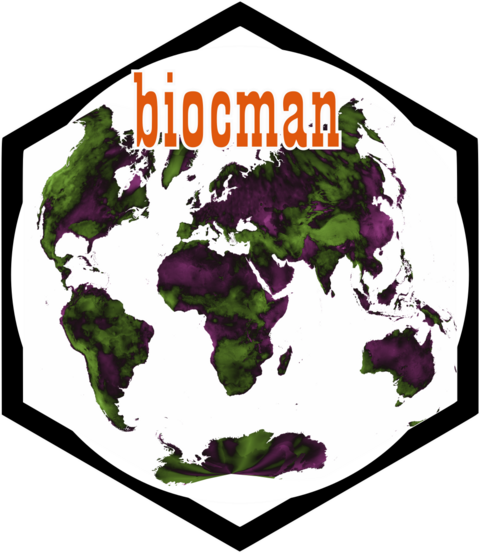

<!-- README.md is generated from README.Rmd. Please edit that file -->

```{r, include = FALSE}
knitr::opts_chunk$set(
  collapse = TRUE,
  comment = "#>",
  fig.path = "man/figures/README-",
  out.width = "100%"
)
```

# biocman 

<!-- badges: start -->
<!-- badges: end -->

The goal of biocman is to is to provide access to 5 synthetic bioclimatic variables learned by a generative A.I. method known as a Variational Autoencoder, which learns low dimensional manifold dimensions from high dimensonal datasets. The 5 variables condense the information contained within the original 19 WorldClim bioclimatic variables. Details can be found [here](https://github.com/rdinnager/bioclim_intrinsic_dimension).

## Installation

You can install the development version of biocman from [GitHub](https://github.com/) with:

``` r
# install.packages("devtools")
devtools::install_github("rdinnager/biocman")
```

## Example

This is a basic example of how to get the data:

```{r example}
library(biocman)
library(terra)
## get data in `rast` format
bioman_vars <- get_data()
plot(bioman_vars)
```

Data can also be encoded or decoded to or from WorldClim and the 5 manifold variables.

```{r example2}
bioman_samp <- spatSample(bioman_vars, 100, na.rm = TRUE)
bioman_samp
## decode to bioclim
bioclim_samp <- biocman_decode(bioman_samp, standardised = FALSE)
bioclim_samp
## reencode back to bioman
bioman_again <- biocman_encode(bioclim_samp)
bioman_again

## should be pretty similar to original
plot(as.vector(bioman_again) ~ as.vector(as.matrix(bioman_samp)))
```
