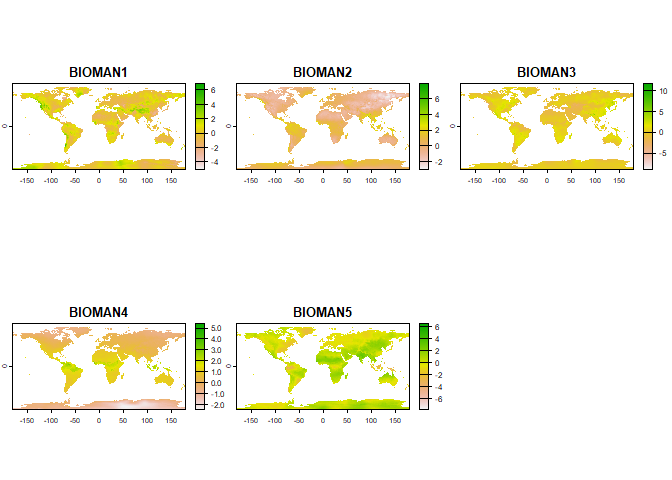
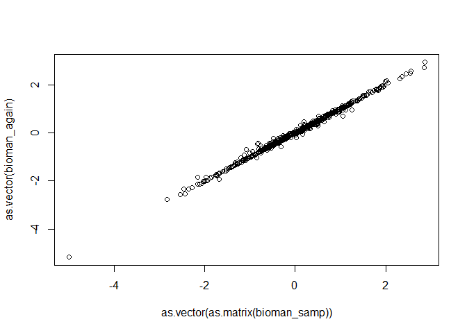

<!-- README.md is generated from README.Rmd. Please edit that file -->

# biocman 

<!-- badges: start -->
<!-- badges: end -->

The goal of biocman is to is to provide access to 5 synthetic
bioclimatic variables learned by a generative A.I. method known as a
Variational Autoencoder, which learns low dimensional manifold
dimensions from high dimensonal datasets. The 5 variables condense the
information contained within the original 19 WorldClim bioclimatic
variables. Details can be found
[here](https://github.com/rdinnager/bioclim_intrinsic_dimension).

## Installation

You can install the development version of biocman from
[GitHub](https://github.com/) with:

``` r
# install.packages("devtools")
devtools::install_github("rdinnager/biocman")
```

## Example

This is a basic example of how to get the data:

``` r
library(biocman)
library(terra)
#> Warning: package 'terra' was built under R version 4.2.2
#> terra 1.7.18
## get data in `rast` format
bioman_vars <- get_data()
plot(bioman_vars)
```



Data can also be encoded or decoded to or from WorldClim and the 5
manifold variables.

``` r
bioman_samp <- spatSample(bioman_vars, 100, na.rm = TRUE)
bioman_samp
#>         BIOMAN1     BIOMAN2     BIOMAN3      BIOMAN4     BIOMAN5
#> 1    0.97392207  1.83286262  0.44626132 -1.269208789  0.12139887
#> 2   -0.63799518  0.41641957  0.03311505 -1.412406087  1.04417717
#> 3   -0.55159229 -1.34968448 -0.77063960  0.197364360 -0.44312835
#> 4    0.49660733  1.24058712 -0.44989970 -0.223999217  0.00185979
#> 5    0.36524409  0.73691374 -1.06665015  1.934700012  0.90739614
#> 6   -0.15636998  0.15400520  0.46291444  0.834038317 -1.03545630
#> 7    1.99576795 -0.71447903 -0.59649289  0.750693917 -0.60028607
#> 8    0.41782403  1.41490996  0.26232898 -0.669181645 -1.01841998
#> 9    0.33485973 -0.01385978 -0.58412343  0.666267574 -0.25162622
#> 10   0.50189584  0.51604807  0.66661501  0.882540703  1.09867299
#> 11  -0.15941413  0.70999622  0.63985705  1.358634949  0.53347832
#> 12   0.64026093 -1.42441297 -1.97261381 -0.586942852 -0.09027255
#> 13   0.16536404 -0.12806532 -0.21911384 -1.381533980  0.06008261
#> 14  -1.67568731  1.40414333 -0.48717427 -0.069206007 -0.36810559
#> 15   0.19144207  0.05584719 -0.76600033  0.129948005 -1.85143769
#> 16   0.61771929  1.16784680  1.46564746  1.063039899  0.63848889
#> 17   0.54286307  0.32601756 -1.32041776  1.790997148  0.78956187
#> 18   0.02409819  0.59412640  0.48160508 -2.274705887  1.49213982
#> 19  -0.53355873 -0.31619468  1.50098932  0.751139283  0.29379067
#> 20   0.31899413 -1.97549200  0.14255762 -0.554063678 -0.23956650
#> 21  -0.85150266  0.53554368  2.86186051 -0.009620775  1.22672391
#> 22   0.31847537 -0.34935275 -0.38941073  0.362385571 -0.67392236
#> 23  -0.75729418  1.17236292 -0.45046264  0.503775179 -0.77803028
#> 24  -0.07026362 -2.11794353 -0.07760500 -0.394100249 -0.14780061
#> 25  -0.71391135  0.84295225  0.27570182 -0.448823959  0.73978931
#> 26  -0.22135620  0.39951319 -0.22941951  0.934733748  1.90630269
#> 27  -0.81217420  0.16702540  1.39195299  0.886235833  0.13266565
#> 28  -0.30645829  0.16200148  0.26375616 -0.477530658 -0.28138059
#> 29   0.59379280 -0.46753964  1.19279945  1.065236926  1.06365371
#> 30  -1.20203018 -0.57284528  0.72223532  0.807279825 -0.21559697
#> 31  -0.12852968  1.07600880  1.89280903  1.098068118  0.47039136
#> 32  -0.17012368 -0.29283082 -0.75646651 -1.049255610 -1.52259457
#> 33  -0.47613978 -1.10181713 -2.45961308  0.341834575 -0.34208271
#> 34   0.64982021 -1.60691571  0.57687598 -0.024762593 -0.36762762
#> 35   0.52580649 -0.41021475 -0.62594402  0.960163474 -0.89698750
#> 36   1.62486541  1.94803488 -0.45006603 -1.763953567 -0.24977224
#> 37   0.23080263 -0.67956203  2.84769177 -0.037754588 -0.43576661
#> 38  -1.52029669 -0.66736060 -0.04419047  0.898646891  0.26440257
#> 39   0.17104053  1.15323210  0.16942993 -0.823955476 -1.18526924
#> 40  -0.50102216  0.16330482 -0.56295002  0.028324543 -0.64752543
#> 41  -5.00328016  1.25906479 -2.43181920  0.755677164 -0.17425849
#> 42  -0.16427961 -1.32058072 -1.27545416  0.949082673  0.37661618
#> 43  -1.72838402  2.36594892  1.10783994  1.050892711  1.08520961
#> 44  -0.37937310  0.85194391 -1.17254341  0.499078184 -0.53784013
#> 45   0.15750110 -0.53777814  0.83051962  0.389334410 -2.00321102
#> 46  -0.08732104  0.88325214  0.64547849  1.046962023  0.18381371
#> 47  -1.01030707 -2.35238409 -0.36845443 -0.647547007 -0.17264062
#> 48   0.46499500  0.78770137  0.02632471  1.050433993  1.03842342
#> 49   0.42217666  1.33613038  0.55760860  1.184521079 -0.23005822
#> 50   0.19671863  0.57086945 -0.44159666 -1.240682840  0.37549236
#> 51   1.24726939 -1.42317080  0.19418581  0.877459109 -0.48351869
#> 52  -1.67827594 -0.88501781 -1.09215593  0.247039855 -0.56692082
#> 53  -0.55544871 -0.97673321 -0.85882169 -0.420023680 -0.24465764
#> 54  -0.43323913  0.30425858  0.17182976  1.178981423  0.19117527
#> 55  -0.40066096 -0.75738049 -0.97802722 -0.529234350  0.16083442
#> 56   1.66827309  0.14557272 -0.50197577 -1.662110686 -0.71901900
#> 57  -0.19866206 -0.77445400  0.35426551 -0.039255071  0.49349368
#> 58   0.88030654  0.38804966 -0.82219583 -0.815929234  0.18872963
#> 59   0.03010058 -0.47394332 -0.58009398  1.220459819  0.27607119
#> 60   2.05134344 -1.14295530 -1.15338767  0.745216727  0.97770989
#> 61  -0.53205812 -1.37874019 -0.78559750  0.101871684  1.58747160
#> 62  -1.12647855 -0.79859757  0.35440367 -1.752965450  1.38117814
#> 63  -2.15857339  0.08796603  0.48480374 -1.734482884 -0.60349447
#> 64   0.95732206 -0.38100374 -1.28843367  0.893081784  0.14539781
#> 65   0.61321908  0.66618854  0.03972589  1.154601216  1.48769712
#> 66  -1.10060441  1.59719765  0.36656678  1.218247056 -0.19831176
#> 67  -1.31463671 -0.41441849  1.79140031  0.354058117 -0.73985672
#> 68   0.04952750 -0.35008895  0.99654073 -0.601084232  0.25129753
#> 69  -0.52168024  0.78340566  0.09004578  1.326695919  0.36909422
#> 70  -2.05900192 -0.16238366  0.87670338 -0.307783127 -0.70427972
#> 71  -1.12960529  0.46961847  0.93912464  1.180412054  1.27567756
#> 72  -0.29459462  1.57642162 -0.02836228  2.565360546 -0.25511253
#> 73  -0.94891828 -0.38769355  0.05266532 -1.873735070  0.13833064
#> 74  -0.31032872  1.02126276 -0.27601966  1.865196705 -0.16130252
#> 75   0.02961146 -0.52438593  1.25464880  0.277723014 -1.87331700
#> 76  -0.10095757 -0.69445199 -0.04717492 -1.604346752 -0.17212895
#> 77  -1.27724493 -0.58152837  0.28195262 -1.444272637 -1.48642647
#> 78  -0.03552321  1.74571204 -0.44879255  0.659398913  2.45854926
#> 79  -0.11039615  0.95019418 -0.33227229  0.120972022 -1.00505054
#> 80   1.03435636  1.53731239 -2.82684994  2.306915998  0.31782109
#> 81   0.01003054  0.03890975 -1.08433151 -0.728751183  0.60670543
#> 82   0.05851877 -0.73411745 -0.64505196 -0.669371486 -0.08512839
#> 83   0.49457210 -1.32857502 -1.69361997  0.609353006  0.68046033
#> 84   1.83240497  0.71339071  0.19501430 -1.374017119 -0.69646382
#> 85   0.43952727  1.17409968 -0.46918595 -0.284358114  0.05137825
#> 86   1.12156773 -1.16079748 -0.74320495 -0.326383412 -0.68508750
#> 87   1.04923749  0.38953286 -0.48404634 -0.599113941 -1.73109090
#> 88   0.70236868 -2.02730250  0.10811788 -0.140128925 -0.35926905
#> 89   0.94279790  0.32729173 -0.84247684 -0.881511509  0.20300764
#> 90   1.36840284 -0.12049647 -1.94535625  0.850556552  0.36877638
#> 91  -0.53777337 -0.93038034  2.54702902 -0.150315061 -0.27120697
#> 92   0.32640600 -0.10806169 -0.26227927 -1.557103276  1.06599033
#> 93   0.74024504  0.05976970  0.10939150 -0.519461811 -1.28340483
#> 94   1.53102005 -0.52750760 -0.23667517  0.823933661 -0.35021225
#> 95   1.05901790  0.23053432  0.23036104  1.241076827  1.80761898
#> 96   0.52061176  0.67838907  0.14416814 -0.961077571 -0.66030371
#> 97   2.02063632  1.95575964 -0.61176366 -2.151888132 -0.36877626
#> 98   0.07179660  1.74402833  1.69519901  1.818364978 -2.54627395
#> 99  -0.94011110  0.32621980 -0.15612526  0.206436411 -0.63747472
#> 100 -0.39671513 -1.67079401  0.89693755 -0.320485353 -0.43494228
## decode to bioclim
bioclim_samp <- biocman_decode(bioman_samp, standardised = FALSE)
bioclim_samp
#>              BIO01      BIO02     BIO03      BIO04        BIO05       BIO06
#>   [1,] -36.1895573 10.0076845  32.08615  837.22931 -17.42062112 -48.5270014
#>   [2,] -38.3036039  7.1429304  22.40255  965.33115 -18.62765432 -50.6134163
#>   [3,]   3.2925161 12.0756159  24.87944 1389.57677  28.99653013 -20.2859410
#>   [4,] -11.2937276  6.4854082  27.89161  593.51467   0.61524920 -21.4919665
#>   [5,]  26.3869336 12.1945118  63.30704  161.37484  36.24222108  17.3745251
#>   [6,]  15.0555878 11.2201932  46.79923  503.58405  27.90865827   3.1110840
#>   [7,]   7.0224177 14.3830107  41.18169  773.76270  26.21089037  -9.3070993
#>   [8,] -26.8645364  7.7716281  28.30671  709.51031 -11.48705724 -38.6324421
#>   [9,]   9.2117224 10.8571493  45.48354  482.57450  22.07740747  -1.4611285
#>  [10,]  19.3965138 13.1105595  56.58865  316.25798  30.03269291   6.7117707
#>  [11,]  24.2092335 11.8762304  76.31731   81.05944  31.61338602  16.1290214
#>  [12,] -12.5099681  8.8615728  15.75461 1789.91804  17.57873514 -38.1666121
#>  [13,] -40.7468031  7.2662443  20.54902 1061.57028 -19.26681873 -54.6194079
#>  [14,]  -6.1967754  3.8532396  25.89919  381.99536   1.55752495 -11.7167188
#>  [15,]  -2.4508053  8.5193457  19.92971 1124.62002  18.04842982 -22.2489135
#>  [16,]  22.2291047 12.5750903  65.06260  176.99871  30.58973353  11.5310855
#>  [17,]  26.4232944 12.8410769  66.81844  154.21577  36.15034074  17.2771232
#>  [18,] -51.2780511  8.9143510  23.15859 1191.61963 -26.97310274 -66.2418748
#>  [19,]  18.1756922 14.2499356  45.35972  623.67755  32.57023027   1.9876912
#>  [20,] -12.4203490 11.0476064  18.17307 1903.46326  19.92333810 -41.4148251
#>  [21,]   9.6436369 11.3319323  26.93936 1136.04431  28.31537455 -13.6040531
#>  [22,]   4.9675007 10.7379602  29.04218  945.48642  24.20278548 -11.9585123
#>  [23,]   5.8357464  5.5563836  44.86839  265.14317  12.58178450   0.6721506
#>  [24,]  -9.0908195 11.7918164  18.61227 1915.35588  23.57980472 -39.0941464
#>  [25,] -17.9011259  5.0988132  21.15167  695.61282  -4.48371265 -27.9159226
#>  [26,]  27.6714042 13.7577093  51.39931  398.55718  40.61216034  13.7227199
#>  [27,]  21.0522487 13.0672680  52.00457  443.54025  32.79151149   7.8776915
#>  [28,] -15.6225587  4.8720071  16.02462  987.26100   0.99320973 -30.2419992
#>  [29,]  20.2229457 16.5641973  58.02018  406.46877  33.10592111   4.5104881
#>  [30,]  19.5694507 13.6996457  40.47045  708.45719  35.60445801   2.9053744
#>  [31,]  22.1800561 12.1790781  66.81044  182.43431  29.89922067  12.1426544
#>  [32,] -37.0829100  7.0461243  19.51874 1071.88498 -15.98686751 -51.7505783
#>  [33,]   9.8808541 11.1992792  22.84824 1348.75909  34.89337717 -12.5878297
#>  [34,]  -3.8827281 13.1064141  24.37320 1543.60383  24.09896223 -30.5344635
#>  [35,]  16.1602697 13.1908355  45.66387  603.54984  31.83998022   2.5484994
#>  [36,] -42.3107817 12.3249985  34.13582  964.25599 -20.50819242 -57.4831301
#>  [37,]  -2.0226415 12.0507252  24.80371 1304.53613  20.78655742 -27.1300341
#>  [38,]  24.4327500 13.7563128  42.63091  651.80037  39.46732695   8.0110720
#>  [39,] -31.4117423  7.8917359  27.57681  769.28568 -14.46623612 -43.5805704
#>  [40,]   0.1453862  7.1693199  20.33864 1005.98606  18.35829218 -16.4962274
#>  [41,]   1.4175283  0.7977455 101.35490  -19.71326   1.67166954   1.3462206
#>  [42,]  23.0158879 15.6780987  41.31156  864.45484  42.32548334   3.7065080
#>  [43,]  26.0793463  6.4789367  68.58818   77.98679  30.20549790  20.7829013
#>  [44,]  10.1326863  6.9866027  36.82639  448.73727  20.46616507   2.0069148
#>  [45,]   2.5727630 11.7065225  26.26279 1169.70743  25.43006208 -19.0820900
#>  [46,]  23.6079297 10.7412705  65.40200  169.48491  31.14856705  15.1039303
#>  [47,] -11.5383029 10.6114637  15.91298 2087.43797  22.87746872 -42.8119867
#>  [48,]  24.1510873 12.2245883  60.88393  168.72648  33.51389833  13.8141006
#>  [49,]  25.0911959 10.0395594  70.92163  115.86349  32.20002990  18.0168846
#>  [50,] -36.5044397  7.8606098  24.36942  929.23160 -17.00817713 -49.4539844
#>  [51,]  11.8068819 17.0129423  42.44164  834.55988  32.08205352  -7.4285753
#>  [52,]   8.0379194 10.3376892  23.31585 1274.47075  31.18110177 -13.5997323
#>  [53,]  -8.1723862  8.1932727  16.47960 1560.23016  18.56067659 -31.5172690
#>  [54,]  21.7686382 10.9921847  71.74018  132.55446  29.12248435  13.9122738
#>  [55,] -10.8256812  7.0959858  15.41704 1481.94529  14.44332767 -32.0134475
#>  [56,] -46.0761011  9.2986862  22.41442 1174.48776 -21.84942429 -62.9395731
#>  [57,]   0.6802165 11.1759242  23.84706 1308.29955  23.70202182 -22.7096079
#>  [58,] -27.4947239  7.0131928  21.87486  920.67396  -9.17643221 -41.2429818
#>  [59,]  20.8034769 14.0591160  63.19152  310.29421  31.90738609   9.4054089
#>  [60,]  13.5654522 16.4080671  40.12277  929.47421  34.66979431  -6.7391432
#>  [61,]   7.2117194 13.2321267  27.11253 1339.12163  30.97289112 -17.4723018
#>  [62,] -45.6858697  5.7802569  15.99985 1227.10175 -22.48824866 -59.5744418
#>  [63,] -47.9955942  7.5407309  21.95233 1071.86970 -25.88685246 -60.9676853
#>  [64,]  17.5091189 13.6871774  44.42863  628.71746  33.96109626   3.0958219
#>  [65,]  25.5154396 13.8823886  62.81090  173.54206  36.20065752  14.2708275
#>  [66,]  26.5388117  7.2522037  72.91216   90.16974  31.88861744  21.7988522
#>  [67,]   9.7081578 11.5838518  28.73005 1086.61814  29.92169745 -11.2703284
#>  [68,] -16.8483724  6.0991038  15.93869 1248.67863   4.21938270 -34.7704022
#>  [69,]  25.4870696 10.2800097  76.42640   75.66438  32.12487030  18.8170998
#>  [70,]  -4.5385386  5.2530902  12.72945 1258.75442  16.28328905 -24.1757419
#>  [71,]  25.9639962 13.0657628  63.74187  245.27583  35.92376973  15.1739053
#>  [72,]  25.9077758 10.1315597  78.68971   47.46168  32.91113263  19.7909455
#>  [73,] -49.2540757  7.2888337  19.11593 1206.08790 -25.25701056 -63.7605002
#>  [74,]  24.5784046  9.7259175  77.16955   72.85847  31.10682188  18.3311465
#>  [75,]   1.1408324 11.2582904  24.42674 1217.25895  24.42700397 -21.0739196
#>  [76,] -45.8142099  6.9242171  17.94091 1216.53348 -22.04012209 -60.9711388
#>  [77,] -46.4559432  6.9585335  19.19371 1151.95125 -23.61704396 -60.7356732
#>  [78,]  26.3852338 10.5596924  43.78868  381.11257  37.95354769  14.0363623
#>  [79,]  -3.1255244  6.2119339  26.10509  641.53779   9.01815181 -14.7866685
#>  [80,]  27.4611891  9.7527141  74.56892  102.33411  35.27542322  22.3263377
#>  [81,] -23.8494823  5.6964325  18.30568  941.88805  -6.37113379 -37.1216934
#>  [82,] -15.6295867  6.7961347  15.17042 1465.00309   9.34392411 -36.0664265
#>  [83,]  15.6739388 14.4813655  32.72841 1132.56133  38.44999207  -6.1745826
#>  [84,] -40.7295034  9.4209561  24.67146 1035.97052 -18.93851166 -56.3768609
#>  [85,] -12.5370553  6.7005870  27.43237  633.39011   0.06218976 -23.3884180
#>  [86,] -10.2095617 10.1480112  19.42480 1574.00581  17.67015824 -34.6366871
#>  [87,] -24.9865561  7.1740092  20.92153  959.80076  -6.29769238 -38.7296566
#>  [88,]  -6.8709585 13.2099264  22.58835 1731.82758  24.09815594 -35.1933139
#>  [89,] -29.2084670  7.1072226  21.92193  941.11294 -10.39156947 -43.0673466
#>  [90,]  18.5875357 13.1964250  40.69267  710.75048  36.25811235   3.7133981
#>  [91,]  -1.5854346 11.5312391  22.08075 1463.31012  23.00403988 -28.6448085
#>  [92,] -41.5264057  7.1111783  19.88569 1100.27305 -19.68257029 -55.3706636
#>  [93,] -21.4220255  6.0087070  18.56240 1010.84969  -3.86811596 -36.2672856
#>  [94,]   7.6681010 14.0892501  48.34200  544.78016  23.10722945  -5.8100153
#>  [95,]  26.0563426 16.3669196  62.24423  256.65138  38.87468746  12.2527028
#>  [96,] -34.0566844  7.6770185  24.37448  889.67838 -15.13758235 -47.2198267
#>  [97,] -48.1533906 13.5157488  33.76757 1079.88738 -23.97563435 -65.2818650
#>  [98,]  23.7648161  9.8959274  88.55235   14.32929  29.24951146  18.1928009
#>  [99,]   5.7494151  7.4741088  24.54955  844.88485  21.46933201  -8.9812921
#> [100,]  -6.8350256 11.0037647  18.85985 1757.23006  23.11443642 -35.3182542
#>             BIO07      BIO08      BIO09       BIO10      BIO11       BIO12
#>   [1,] 31.1041462 -43.617680 -25.296690 -24.3412054 -43.547704  201.608242
#>   [2,] 31.9857231 -45.032450 -33.040866 -24.5744240 -46.537905   31.445173
#>   [3,] 49.2791798  18.242442  -8.739981  20.1171855 -13.736791  240.017043
#>   [4,] 22.1059590 -12.845709  -4.734197  -3.0690524 -17.334263  371.298950
#>   [5,] 18.8659018  25.338346  25.694769  28.4164310  24.637116 1096.239142
#>   [6,] 24.8005577  19.885100   8.987346  21.0726617   8.701792  883.329568
#>   [7,] 35.5254946   2.596831  16.550379  16.8010922  -2.038599  393.888560
#>   [8,] 27.1469142 -29.007504 -17.224804 -17.0890721 -34.121207  494.621809
#>   [9,] 23.5471062   8.150461  12.083455  15.3400318   3.735292  245.867645
#>  [10,] 23.3192190  22.446781  14.926505  22.8324750  15.108056  715.958353
#>  [11,] 15.4853051  23.936847  23.616349  25.0996325  23.209950 1221.220296
#>  [12,] 55.7585460   6.241413 -19.070666   9.8915779 -33.365530  191.671787
#>  [13,] 35.3483623 -49.160121 -32.878253 -25.6132856 -49.995706   21.112382
#>  [14,] 13.2809036  -5.820367  -1.613413  -0.7405865  -9.648963  532.478455
#>  [15,] 40.2994171   5.149388  -7.000636  11.3487633 -16.219606  971.336214
#>  [16,] 19.0568306  23.722581  19.938902  23.9133948  19.739194 1526.857788
#>  [17,] 18.8727846  25.556409  25.642839  28.2197501  24.552686  741.221321
#>  [18,] 39.2759136 -60.643017 -42.324233 -34.3209650 -61.238467   36.615817
#>  [19,] 30.5921251  25.017814  12.033415  25.4258572  10.185602  548.943805
#>  [20,] 61.3337744  10.910155 -30.863739  11.0864358 -35.022330  317.367802
#>  [21,] 41.9272761  21.311448  -4.680855  22.5266981  -5.636469 1062.772922
#>  [22,] 36.1626240  14.567531  -1.603339  16.6528882  -6.346895  458.488176
#>  [23,] 11.9124438   4.500953   5.659174   9.3919543   3.118314  966.727807
#>  [24,] 62.6695926  13.942114 -27.314701  14.2598945 -32.296313  341.840565
#>  [25,] 23.4387409 -20.958529  -6.461909  -8.2001688 -24.545191  195.419691
#>  [26,] 26.8859968  28.714218  24.524784  32.2683312  22.437957  515.442351
#>  [27,] 24.9181413  25.839728  15.381297  26.0677462  15.346730  796.593646
#>  [28,] 31.2408349  -5.863475 -20.077336  -2.4726046 -26.058447  215.410019
#>  [29,] 28.5935262  24.169966  15.940163  24.6462631  14.754449  399.959125
#>  [30,] 32.6996078  26.629986  12.521588  27.8451175  10.433875  451.911290
#>  [31,] 17.7544210  24.092722  19.642521  23.8843994  19.686990 1438.992687
#>  [32,] 35.7590374 -41.817046 -28.503293 -21.9465371 -46.967430   32.790785
#>  [33,] 47.4904625   9.859956  19.829140  26.2794677  -6.755637  150.759534
#>  [34,] 54.6318963  14.102120 -18.124226  14.8334663 -22.872759  431.883224
#>  [35,] 29.3036442  12.074841  22.536731  23.5441557   8.803290  532.822161
#>  [36,] 36.9688416 -51.335631 -29.961611 -28.8427193 -51.117282  140.980634
#>  [37,] 47.9218643  13.650256 -18.906166  13.4990222 -18.828389  837.834705
#>  [38,] 31.4542765  30.071149  18.750395  31.8286135  15.785013  194.882569
#>  [39,] 29.1146938 -34.683045 -20.998135 -20.6617501 -38.864010  366.077014
#>  [40,] 34.8571925  11.548766  -6.480603  12.6069126 -11.962882  531.048389
#>  [41,]  0.3204118  -1.709861   2.478477   1.4481814   2.415481  456.451523
#>  [42,] 38.6196918  16.067829  32.363064  33.1406610  11.965830   42.779253
#>  [43,]  9.4226228  26.832965  24.453940  26.7103335  24.936100 2375.586866
#>  [44,] 18.4596168   7.131091  13.775359  16.0090265   5.135932  758.512380
#>  [45,] 44.5095187  14.057203  -7.308166  16.7413413 -11.958623 1030.933738
#>  [46,] 16.0446075  24.825899  21.541582  25.3328209  21.286056 1160.104544
#>  [47,] 65.6830078  13.596832 -32.916146  14.0379120 -36.593653  286.551020
#>  [48,] 19.6951101  23.683449  22.065948  26.0448803  21.911287 1046.742723
#>  [49,] 14.1848977  25.392068  23.979442  26.3750756  23.534046 1808.861528
#>  [50,] 32.4444629 -43.693606 -27.751209 -23.4105251 -44.812682   52.689721
#>  [51,] 39.5066649  16.219044   5.876152  21.8105310   1.448817  242.447617
#>  [52,] 44.7752427  21.265306  -4.366303  23.3270973  -7.857955  242.211816
#>  [53,] 50.0736135   9.525474 -21.244322  11.2967674 -26.529247  239.461161
#>  [54,] 15.2108720  22.698570  20.132866  23.1462206  19.943922  650.310334
#>  [55,] 46.4539213   6.756646 -24.011172   7.9182576 -27.741451  150.465023
#>  [56,] 41.0900087 -55.390047 -29.898115 -29.5049946 -56.727207   47.471578
#>  [57,] 46.4118316  15.893950 -13.147370  16.2651073 -15.902347  378.370159
#>  [58,] 32.0678804 -32.705854 -14.544689 -14.6652940 -36.332051  109.026309
#>  [59,] 22.5073908  19.872677  21.503744  24.2123062  16.696018   26.210110
#>  [60,] 41.3988745   3.924181  24.856625  24.6845093   1.884259  207.464421
#>  [61,] 48.4476002  22.975999  -7.096121  22.8706872  -9.902790   72.149489
#>  [62,] 37.0917189 -55.029902 -37.993361 -27.9159794 -55.783226    2.344559
#>  [63,] 35.0772794 -56.705953 -44.223690 -32.5892715 -56.861306    6.752618
#>  [64,] 30.8627348  12.134699  23.463733  25.2148881   9.866715  296.843084
#>  [65,] 21.9224121  25.116882  23.791106  27.6267860  23.463008  915.011766
#>  [66,] 10.0929363  27.266742  26.194843  27.5892318  25.361073 1965.802548
#>  [67,] 41.1979015  22.951131  -2.815124  22.5904195  -4.262718  865.059261
#>  [68,] 38.9920016  -1.671457 -29.525695  -0.5452694 -30.274423  265.529584
#>  [69,] 13.3101498  24.847975  25.060110  26.3587732  24.516853 1200.105533
#>  [70,] 40.4492718   8.851418 -18.851037  11.1577275 -19.534661  525.927353
#>  [71,] 20.7411108  27.000984  23.435817  28.7759375  23.054715  659.217388
#>  [72,] 13.1190687  25.273328  26.227321  26.6128951  25.518416 2539.653498
#>  [73,] 38.5022224 -59.335192 -41.979678 -31.9297490 -59.384103    6.201079
#>  [74,] 12.7769279  24.269666  24.629518  25.4183086  23.598679 1655.296055
#>  [75,] 45.4975514  13.449097  -9.787884  15.8988933 -14.000075  990.949024
#>  [76,] 38.9278761 -55.469848 -37.274203 -28.4026292 -56.349828    5.487812
#>  [77,] 37.1136384 -55.022817 -39.917261 -29.9436681 -56.387293   -9.875063
#>  [78,] 23.9191740  27.724076  24.115211  30.7496689  21.317709 1435.820184
#>  [79,] 23.8073974   1.823550  -6.195489   5.0153729 -10.565424  928.037869
#>  [80,] 12.9602500  25.864880  28.010449  28.7963463  26.338308 2054.310465
#>  [81,] 30.7551547 -28.099558 -12.528751 -10.8015727 -33.007696   69.649015
#>  [82,] 45.4097389   2.996935 -29.544865   3.2059623 -31.823651  127.541732
#>  [83,] 44.6243130  10.630171  27.267121  29.1635951   1.415806   93.411603
#>  [84,] 37.4401249 -48.457302 -24.024900 -26.2017432 -50.314914  125.871031
#>  [85,] 23.4489990 -15.115917  -4.732726  -3.8261882 -19.103599  325.067735
#>  [86,] 52.3113389   7.220039 -18.604874   9.4909335 -28.719263  329.721079
#>  [87,] 32.4177152 -29.902246 -23.031427 -11.7492172 -34.504797  386.108902
#>  [88,] 59.2897686  14.076972 -22.168303  14.2744117 -27.803830  359.463617
#>  [89,] 32.6774046 -34.819453 -16.165769 -16.0578698 -38.146566   97.049943
#>  [90,] 32.5330765  11.419118  25.997489  27.3217401   9.951685  488.587599
#>  [91,] 51.6504318  15.583664 -20.722290  15.7143561 -20.523626  780.860005
#>  [92,] 35.6878675 -50.417559 -33.189715 -25.8557563 -51.017228   16.967915
#>  [93,] 32.4105889 -10.487158 -24.212690  -7.7010764 -31.694567  280.381817
#>  [94,] 28.9237650   4.403087  12.079121  14.5616555   1.410826  225.798047
#>  [95,] 26.6140226  25.339878  24.965904  29.0981388  22.880521  654.115297
#>  [96,] 32.0817710 -39.129580 -21.320899 -21.5033898 -42.235276  158.826950
#>  [97,] 41.3009411 -58.276166 -33.666114 -33.1570409 -58.104581  102.658426
#>  [98,] 11.0540612  24.298192  23.420169  23.8575856  23.511988 3204.194846
#>  [99,] 30.4519519  15.764243  -1.585666  16.0387227  -4.659124  585.413581
#> [100,] 58.4259366  13.211240 -25.135044  14.5602622 -28.354645  499.477246
#>              BIO13        BIO14     BIO15       BIO16        BIO17        BIO18
#>   [1,]  67.8638751  -0.55166490 122.25601  135.264196   5.58172119   5.01807941
#>   [2,]  18.2406212   0.12994145 153.20099   20.562329  -0.32309587   2.60855830
#>   [3,]  29.7611329  12.29833357  27.44979   81.510607  43.34071682  77.75477474
#>   [4,]  64.0083915   0.29805841  59.64105  160.999714  19.69447986  25.52841708
#>   [5,] 237.1227154   1.78874692  97.64579  631.168971   7.20111833 165.53886320
#>   [6,]  96.7128443  49.91023340  22.32753  265.068486 170.08181271 254.39780607
#>   [7,]  46.8308828  15.06993230  27.57373  136.473961  57.79687421  67.96600665
#>   [8,]  74.0602851   2.31301626  53.97030  184.667495  40.33625189  47.44430782
#>   [9,]  22.7681830  12.11993972  29.51598   75.489723  43.67950497  57.68153394
#>  [10,] 168.7323576   2.28178223 102.33782  442.314591  12.72085475 314.30184434
#>  [11,] 197.2672586   4.34943186  73.15839  530.531085  31.15546760 321.56601841
#>  [12,]  34.5263051   4.60859673  56.60308   77.818002  19.52591783  78.26962522
#>  [13,]   8.9260823   0.21224063 110.78798   13.878852  -0.72729984  -1.16888341
#>  [14,]  73.5688087  11.66880304  40.60954  185.595685  59.94019928  65.92933805
#>  [15,] 104.5319135  59.08997769  16.70973  290.233596 193.94288498 261.78529373
#>  [16,] 274.7999102  12.06677742  77.79035  753.708327  52.07914386 562.81880433
#>  [17,] 175.3035540   1.07261206  99.31301  457.944034  -0.95352840  55.21716284
#>  [18,]  33.5558722  -0.28314482 223.18725   33.745378   0.10364748   4.10107805
#>  [19,] 107.6088681   9.45892211  67.63195  268.094173  38.09095179 258.03016779
#>  [20,]  55.9137847   9.34489572  60.72066  151.932230  31.91567181 154.47636827
#>  [21,] 271.4909725  11.16691682  98.00738  653.453082  50.04914177 624.75723678
#>  [22,]  54.6458869  23.24850685  27.14302  153.809096  79.94973739 138.43225067
#>  [23,] 106.6997018  56.58798841  16.85912  304.686168 187.30027128 264.26379486
#>  [24,]  56.9956678   8.74346090  58.97823  156.432348  31.08107365 153.33273986
#>  [25,]  47.6925307  -0.20015675  87.62694   97.473282   5.46038531   1.57196814
#>  [26,] 176.1454556   0.78824423 131.45085  414.418689   6.37302139  80.90895154
#>  [27,] 132.7115737  12.74795527  62.96582  357.995018  48.56527472 363.41217957
#>  [28,]  32.8530764   6.79239504  52.75836   76.759502  23.42890153  70.02608979
#>  [29,]  90.4460359   0.33940330 103.93354  240.369888   3.53238434 181.63436147
#>  [30,]  68.4477922  14.52866321  47.65179  171.194066  52.64969931 157.71481980
#>  [31,] 254.6018060  12.30680460  75.36545  689.000352  54.26196502 688.27669393
#>  [32,]   0.2484347   0.28332146  28.65266    7.574441   0.74382291  -4.23731864
#>  [33,]  17.4809149   6.44150903  26.39879   42.986407  23.80256695  30.83840630
#>  [34,]  69.2468210  14.09252265  51.52483  184.993011  49.77340511 186.44070754
#>  [35,]  51.6282261  32.11603109  15.22020  144.775932 111.62564124 126.61613144
#>  [36,]  53.1106583  -0.04350699 135.88831   96.992303   3.30610634   3.08650699
#>  [37,] 145.4820106  18.85876647  66.99142  386.917458  67.56015366 390.66831932
#>  [38,]  36.2214796   4.36183433  54.66902   87.174625  16.91818767  72.38395829
#>  [39,]  54.0510001   1.99971427  54.70381  133.300603  30.61224197  35.42400642
#>  [40,]  69.9529313  23.89009501  33.58059  191.205388  80.63217965 186.32615654
#>  [41,]  63.2726986  12.22535459  37.86897  150.684453  49.40375164 102.27334823
#>  [42,]   5.2515175  -0.12227273  54.46422   13.393391  -0.38584804  -2.90675580
#>  [43,] 434.6747183   6.26271923  77.72641 1168.743740  46.08259994 824.04137201
#>  [44,]  90.9594503  38.21758308  22.50407  253.991203 130.19165690 150.16136475
#>  [45,] 110.3120105  60.11943185  16.51195  310.877936 201.00985848 296.04313626
#>  [46,] 200.9665628  19.26657236  68.12029  528.873227  75.33847957 391.62907321
#>  [47,]  50.1184997   7.34091065  59.00343  134.167569  27.34241624 123.11305231
#>  [48,] 204.4039645   1.98514706  88.48587  559.205355  12.32601198 180.42901857
#>  [49,] 282.0359171  43.09698807  56.86777  753.633506 161.93367406 405.45219459
#>  [50,]  18.8008556   0.28901551 119.08743   27.695752  -0.30213820  -0.27410993
#>  [51,]  29.2050830  12.26002318  25.71516   82.578106  45.99618252  60.06809101
#>  [52,]  27.5293975  13.83376814  20.36286   73.536274  47.70467583  76.13598574
#>  [53,]  41.0679772   9.01898194  49.12175  105.308735  30.87876434  99.55921847
#>  [54,] 107.5513541   9.14116376  64.02441  272.425484  42.28252629 230.03671755
#>  [55,]  29.4759918   5.42148672  58.78260   75.611052  18.12901191  63.27081643
#>  [56,]  20.0372164   0.39467758 105.87241   30.748754   0.14064193   2.12681889
#>  [57,]  80.6590867   7.43378872  73.12755  202.806328  25.81782837 199.45826907
#>  [58,]  25.1840615   0.30299600  86.52102   50.819817   0.82403981   0.21369462
#>  [59,]   6.3931785   0.39436445  70.84343   13.454632   4.15504562   2.67746141
#>  [60,]  42.0916324  -0.06219270  90.23956  115.465002   3.19053162   4.17865036
#>  [61,]  27.3670838   0.56501943 112.10056   56.291740   2.85766940  58.70246681
#>  [62,]  11.3550595  -0.07158169 171.89324    8.537734   0.88157453   0.16750284
#>  [63,]   9.3477500  -0.21816181 107.10877    9.903873  -0.14607608   0.94309406
#>  [64,]  48.2690314   4.26685910  55.07270  132.128059  18.39718602  23.75704357
#>  [65,] 222.9047377   0.12006133 110.74571  581.443288  -1.47599270 127.42576767
#>  [66,] 296.2036071  45.78663207  55.96791  789.835739 175.31349654 504.94006252
#>  [67,] 123.8521357  28.35740092  44.04623  327.941095  99.55684821 309.72527601
#>  [68,]  52.4851320   4.30171887  71.62263  136.305738  15.24904353 113.89124055
#>  [69,] 192.9507358   8.89031129  67.49694  503.948980  48.40606016 249.05246981
#>  [70,]  79.2559352  19.92037017  44.60932  208.527229  68.50155711 191.60288086
#>  [71,] 185.9480813   0.87987802 115.88348  447.605395   2.41100089 390.27351363
#>  [72,] 371.7540747  40.73855801  55.35470 1042.004794 171.49526892 561.00906219
#>  [73,]  11.0648211  -0.16425212 139.28717   10.519315   0.11681742  -0.60879158
#>  [74,] 246.4516274  32.09361583  54.00960  670.146693 130.40871374 336.63049446
#>  [75,] 114.8496691  53.37737283  23.37195  321.621414 178.83919556 310.25736051
#>  [76,]   6.7195030   0.10209418 108.68648    9.255437  -0.30341236  -1.62152771
#>  [77,]   0.7589879   0.04073195  49.16965    2.914060  -1.07295854  -1.38756920
#>  [78,] 410.1549021   2.15206177 127.90864 1034.330090  12.93608823 250.20900039
#>  [79,] 110.1954538  47.84139057  24.93820  301.395181 159.93294185 272.00248950
#>  [80,] 393.4081561  12.30657799  88.40430 1054.862768  64.48786464  66.07756049
#>  [81,]  17.5293094  -0.02882607  90.48555   28.693671  -0.02236214   1.77372206
#>  [82,]  27.6301505   5.64227322  56.11565   69.002989  17.64093609  63.93312571
#>  [83,]  17.5915318   0.77603375  69.86685   45.151778   3.55421524   5.59252102
#>  [84,]  37.1793774   0.31077814  94.02981   68.311375   2.14862914  -0.09844052
#>  [85,]  57.2746210   0.39862304  62.80476  140.767712  17.45967644  21.24259108
#>  [86,]  53.7763632  13.42376622  42.72119  140.974021  46.80740238 135.95839729
#>  [87,]  52.4118755  17.49796736  27.99813  136.443778  65.98864446 100.59942355
#>  [88,]  54.3044326  11.08130833  49.01169  150.519806  40.19788790 144.95128422
#>  [89,]  22.9460462   0.34266810  90.29941   45.052714   0.79348203   0.68636928
#>  [90,]  85.7489308   3.45084438  67.15766  234.428613  15.73557335  24.77736113
#>  [91,] 142.9162740  15.89250300  69.91195  376.247350  57.63165135 379.15821515
#>  [92,]  15.0383610   0.05527444 157.94256   15.173714  -0.94531778  -1.02602291
#>  [93,]  40.4119891  14.66928188  27.73871   95.349722  49.10270761  94.25447033
#>  [94,]  21.5043809  11.02803974  30.75995   70.656958  40.87690861  47.47724858
#>  [95,] 193.4707671  -0.33950518 127.42876  481.524456  -3.90792780  61.46520562
#>  [96,]  37.4312506   0.53695297  71.94138   79.116703   8.05301508  11.81153461
#>  [97,]  47.6172769  -0.03341427 154.14223   75.078703   0.78868747   0.24381158
#>  [98,] 356.9679837 172.13552672  23.38070  997.665649 578.95400264 881.78632905
#>  [99,]  79.3770011  27.87399522  33.09893  216.204734  93.42430325 212.46404094
#> [100,]  80.6454756  13.63302330  59.25827  218.803309  48.38611578 213.07811474
#>                BIO19
#>   [1,]  115.81555262
#>   [2,]   13.09802435
#>   [3,]   53.42222721
#>   [4,]  131.44405159
#>   [5,]  627.42671547
#>   [6,]  176.49488442
#>   [7,]  109.14295721
#>   [8,]  159.17337804
#>   [9,]   52.80423314
#>  [10,]   17.99089904
#>  [11,]   48.14798749
#>  [12,]   37.81323489
#>  [13,]    9.38714185
#>  [14,]  141.10516389
#>  [15,]  236.42810615
#>  [16,]   65.13800993
#>  [17,]  453.22220536
#>  [18,]   33.33803762
#>  [19,]   45.67966707
#>  [20,]   33.17490227
#>  [21,]   64.56472740
#>  [22,]   93.76190724
#>  [23,]  210.35118293
#>  [24,]   40.76833835
#>  [25,]   59.34004088
#>  [26,]    8.93660566
#>  [27,]   49.42045744
#>  [28,]   35.91397830
#>  [29,]    9.13559439
#>  [30,]   62.57020880
#>  [31,]   58.83209336
#>  [32,]    7.53782645
#>  [33,]   41.02814285
#>  [34,]   60.73739655
#>  [35,]  145.96813617
#>  [36,]   88.20308506
#>  [37,]   63.64206702
#>  [38,]   29.85530855
#>  [39,]  119.69740742
#>  [40,]  100.32673724
#>  [41,]   80.37595990
#>  [42,]   11.43080107
#>  [43,]   77.23035153
#>  [44,]  226.84120342
#>  [45,]  222.65261463
#>  [46,]   98.44464606
#>  [47,]   30.31177386
#>  [48,]   27.71148282
#>  [49,]  212.34320147
#>  [50,]   19.47439628
#>  [51,]   51.32992193
#>  [52,]   54.75399376
#>  [53,]   35.59055467
#>  [54,]   51.51209056
#>  [55,]   19.30296017
#>  [56,]   26.34187923
#>  [57,]   30.44327451
#>  [58,]   32.07967733
#>  [59,]    8.53043126
#>  [60,]  110.40500475
#>  [61,]   -1.22727369
#>  [62,]    3.35378422
#>  [63,]    8.82697442
#>  [64,]  128.08007421
#>  [65,]    5.25362552
#>  [66,]  219.31843036
#>  [67,]   97.22979030
#>  [68,]   20.36384543
#>  [69,]   81.87838659
#>  [70,]   74.48160585
#>  [71,]   -2.97927512
#>  [72,] 1039.70317354
#>  [73,]    9.03148242
#>  [74,]  582.60099226
#>  [75,]  197.18369614
#>  [76,]    5.77589034
#>  [77,]    0.77834082
#>  [78,]   26.73403141
#>  [79,]  217.29293555
#>  [80,] 1083.00929475
#>  [81,]   11.22230389
#>  [82,]   15.89044055
#>  [83,]   36.88662632
#>  [84,]   60.12289165
#>  [85,]  116.77753506
#>  [86,]   62.14313769
#>  [87,]  130.85659110
#>  [88,]   54.67026483
#>  [89,]   28.27671596
#>  [90,]  223.14923944
#>  [91,]   58.36083532
#>  [92,]   10.61038649
#>  [93,]   70.81546495
#>  [94,]   60.88391399
#>  [95,]    0.05153521
#>  [96,]   65.41630125
#>  [97,]   72.43328805
#>  [98,]  615.95686804
#>  [99,]  106.97543142
#> [100,]   56.98452664
## reencode back to bioman
bioman_again <- biocman_encode(bioclim_samp)
bioman_again
#>                [,1]        [,2]        [,3]          [,4]        [,5]
#>   [1,]  0.862350583  1.82576525  0.34314936 -1.2959306240  0.09908405
#>   [2,] -0.523572803  0.40246558 -0.03932313 -1.4078980684  1.06208038
#>   [3,] -0.588405132 -1.34460342 -0.74522406  0.2013015002 -0.44045621
#>   [4,]  0.287184060  1.30360901 -0.42221978 -0.2625891566 -0.01395045
#>   [5,]  0.404632509  0.72828919 -1.07183623  1.9644447565  0.87422591
#>   [6,] -0.188444644  0.13816622  0.38620135  0.8452066183 -1.04226100
#>   [7,]  2.142861605 -0.69163382 -0.55838275  0.7483887076 -0.59299105
#>   [8,]  0.436162919  1.40273845  0.27768421 -0.6671264172 -1.03775382
#>   [9,]  0.354319394  0.01413034 -0.54066777  0.6675558686 -0.20867802
#>  [10,]  0.370120227  0.50825554  0.71324068  0.8888818026  1.11882496
#>  [11,] -0.094594330  0.71061391  0.61496621  1.3322912455  0.58467185
#>  [12,]  0.475554347 -1.42816436 -1.85540211 -0.5772405863 -0.07279733
#>  [13,] -0.058057308 -0.09614324 -0.18087734 -1.3956285715  0.04955629
#>  [14,] -1.928644538  1.41190922 -0.51683450 -0.0695963204 -0.32387424
#>  [15,]  0.461555272  0.04787472 -0.84548408  0.1294025630 -1.84331799
#>  [16,]  0.707031012  1.18330431  1.45104253  1.0410147905  0.62807733
#>  [17,]  0.526117086  0.34907213 -1.23647094  1.7822160721  0.83334911
#>  [18,]  0.135531858  0.53393376  0.36752987 -2.2612459660  1.50775814
#>  [19,] -0.643281460 -0.35176980  1.56271732  0.7613881230  0.31024262
#>  [20,]  0.297800601 -1.98005378  0.06873903 -0.5603928566 -0.25634646
#>  [21,] -1.027195811  0.48627222  2.93142867  0.0003592521  1.18639326
#>  [22,]  0.195166871 -0.34213498 -0.24343425  0.3641631305 -0.69723874
#>  [23,] -0.729543924  1.13067615 -0.43326327  0.5125486255 -0.76692331
#>  [24,] -0.081131920 -2.14420033 -0.01588428 -0.4009177387 -0.13964362
#>  [25,] -0.727306128  0.83033627  0.16731010 -0.4658915401  0.69821572
#>  [26,] -0.176328227  0.41448748 -0.26627347  0.9339665771  1.92665076
#>  [27,] -0.652405262  0.20303300  1.36365426  0.8778716922  0.12358411
#>  [28,] -0.576774240  0.15174255  0.32825026 -0.4801869988 -0.26509035
#>  [29,]  0.594823360 -0.43549255  1.18379569  1.0747524500  1.05543327
#>  [30,] -1.048968196 -0.55506927  0.78168452  0.7977280021 -0.25421709
#>  [31,] -0.024686851  1.09719002  1.88073027  1.0825275183  0.46559638
#>  [32,] -0.124433011 -0.29123479 -0.54256982 -1.0583593845 -1.57321918
#>  [33,] -0.446930200 -1.14407849 -2.33313107  0.3364093006 -0.36001354
#>  [34,]  0.606725216 -1.62391555  0.58219731 -0.0183429718 -0.40633798
#>  [35,]  0.609920621 -0.40023986 -0.70435697  0.9503100514 -0.87805516
#>  [36,]  1.705158591  1.92042303 -0.46698076 -1.7682282925 -0.29787183
#>  [37,]  0.325461090 -0.68543273  2.71935582 -0.0274641104 -0.35228395
#>  [38,] -1.508979440 -0.67609787 -0.05941285  0.8997454047  0.23549876
#>  [39,]  0.204615608  1.13415194  0.14500824 -0.8197935820 -1.23151064
#>  [40,] -0.444033772  0.17866617 -0.54043931  0.0114164110 -0.64464480
#>  [41,] -5.168820858  1.23790622 -2.53944087  0.7722615600 -0.15974452
#>  [42,] -0.176533043 -1.29751313 -1.30255759  0.9541667700  0.36183244
#>  [43,] -1.772218466  2.34018016  1.13293982  1.0711028576  1.06034124
#>  [44,] -0.370694816  0.84978145 -1.14550221  0.4867274165 -0.55105907
#>  [45,]  0.092258438 -0.54539520  0.93376291  0.3834280670 -2.00666189
#>  [46,] -0.018225372  0.89080071  0.63935465  1.0535010099  0.16521789
#>  [47,] -0.836305022 -2.34118390 -0.23867545 -0.6457954049 -0.18865831
#>  [48,]  0.471499532  0.79541820  0.02928214  1.0427500010  1.04465699
#>  [49,]  0.486539334  1.32312059  0.52040750  1.2099403143 -0.23369302
#>  [50,]  0.225021482  0.57936865 -0.33269489 -1.2436879873  0.36058557
#>  [51,]  0.959603548 -1.41588247  0.35550755  0.8805555701 -0.46864003
#>  [52,] -1.677622557 -0.90908438 -1.08904469  0.2427820116 -0.50615340
#>  [53,] -0.606413484 -0.98718369 -0.89715177 -0.4173983634 -0.23617397
#>  [54,] -0.448245734  0.27837101  0.22106318  1.1995580196  0.17017576
#>  [55,] -0.440699786 -0.76728040 -1.00944614 -0.5321798325  0.14375488
#>  [56,]  1.722886801  0.11820301 -0.38409731 -1.6553874016 -0.68095499
#>  [57,] -0.263890594 -0.76531023  0.40828899 -0.0450236462  0.51888764
#>  [58,]  0.946207404  0.35374430 -0.42614478 -0.8186294436  0.15277228
#>  [59,] -0.195292652 -0.52122355 -0.43649706  1.2491171360  0.22545265
#>  [60,]  2.079409599 -1.14956570 -1.15059066  0.7393661141  0.97676688
#>  [61,] -0.430659056 -1.36881018 -0.75779796  0.0942460746  1.59760320
#>  [62,] -1.083072305 -0.79553169  0.32775882 -1.7519123554  1.33750141
#>  [63,] -1.848342061  0.07306003  0.35772774 -1.7216373682 -0.58600491
#>  [64,]  0.859890103 -0.41310668 -1.28487265  0.8806614280  0.11523333
#>  [65,]  0.578246951  0.66615462  0.05996814  1.1437172890  1.50531650
#>  [66,] -1.101906180  1.57634056  0.38875243  1.2447994947 -0.19791918
#>  [67,] -1.312670827 -0.38538301  1.80593741  0.3535076082 -0.75131786
#>  [68,]  0.042337053 -0.33166629  1.02203262 -0.5981156826  0.18528917
#>  [69,] -0.491328746  0.77788872  0.09199917  1.3207079172  0.38862973
#>  [70,] -2.097228527 -0.16540012  0.88402063 -0.3032025695 -0.68857270
#>  [71,] -0.921482086  0.51043153  0.87705255  1.1334182024  1.32581198
#>  [72,] -0.240949512  1.57334375 -0.01901204  2.5587575436 -0.27259511
#>  [73,] -0.771228433 -0.37658006  0.12121559 -1.8682287931  0.13462709
#>  [74,] -0.343485028  1.01913142 -0.20710909  1.8682373762 -0.13986917
#>  [75,]  0.001478061 -0.53187102  1.25718892  0.2712622583 -1.87850559
#>  [76,] -0.190319061 -0.68209159  0.01448666 -1.6057736874 -0.17416508
#>  [77,] -1.206153631 -0.60102481  0.30825272 -1.4418205023 -1.49421144
#>  [78,]  0.034888372  1.74865985 -0.41704038  0.6663199067  2.44986296
#>  [79,] -0.034827031  0.98985678 -0.19586085  0.1145709753 -1.00474811
#>  [80,]  1.119762659  1.56921685 -2.76246572  2.2556385994  0.35009542
#>  [81,] -0.089372143  0.03317709 -0.68541604 -0.7245927453  0.60437226
#>  [82,]  0.021892227 -0.74161309 -0.60063022 -0.6638724804 -0.09183465
#>  [83,]  0.483588427 -1.30499482 -1.70523369  0.6079630852  0.69081467
#>  [84,]  1.755184770  0.74168801  0.07525635 -1.3750734329 -0.66170305
#>  [85,]  0.476928413  1.21635342 -0.48400792 -0.3146662414  0.03568558
#>  [86,]  0.968033075 -1.12640429 -0.61725575 -0.3373208642 -0.64876133
#>  [87,]  0.692913055  0.48195386 -0.21824037 -0.6241389513 -1.76565588
#>  [88,]  0.739492655 -2.01463103  0.05593394 -0.1442746520 -0.37118030
#>  [89,]  0.990558863  0.29847303 -0.46264547 -0.8846465349  0.16971812
#>  [90,]  1.333353400 -0.11651584 -1.98227096  0.8331634998  0.34680951
#>  [91,] -0.423439085 -0.92093211  2.47179604 -0.1439799219 -0.29806876
#>  [92,]  0.162178650 -0.08866677 -0.11472694 -1.5728552341  1.04011381
#>  [93,]  0.631217837  0.03853364  0.32202941 -0.5207879543 -1.27067697
#>  [94,]  1.571694255 -0.53908825 -0.14549768  0.8229584694 -0.36803168
#>  [95,]  0.963517904  0.23215023  0.24476697  1.2178820372  1.82980108
#>  [96,]  0.700250030  0.64429682  0.21215074 -0.9461919665 -0.63309252
#>  [97,]  2.174969435  1.92588496 -0.60048920 -2.1395840645 -0.42370707
#>  [98,]  0.052242994  1.76339936  1.66716409  1.7989312410 -2.55288649
#>  [99,] -0.954002023  0.31553450 -0.11970603  0.2084136903 -0.65002251
#> [100,] -0.369591981 -1.66990709  0.76957899 -0.3230112493 -0.40561557

## should be pretty similar to original
plot(as.vector(bioman_again) ~ as.vector(as.matrix(bioman_samp)))
```


